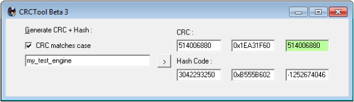

* Do not remove this line (it will not be displayed)
{:toc}

# Alchemy

_**Author: Treewyrm**_

*WIP: Still being converted to online format*

This guide explains the how Freelancer particle system (Alchemy) works and how to edit and create your own particle effects.

In Freelancer particle system is used extensively for dynamic visual effects such as weapon projectiles, engine exhausts, explosions, jumpholes and jump effects, environment elements such as rain at Leeds planetscape background or sand winds at Malta, even tiny dust particles in space. They’re also extensively used in real-time cutscenes and prominently visible in main menu backgrounds: animated star and ash clouds of a volcanic planet.

The particle system in Freelancer is quite similar to particle systems in other games and engines, although not at powerful or expressive as some are. Feature-wise it’s quite basic but for most of the part it works well enough.


## Tools
To create your own effects or edit existing ones you'll need several tools to work with Alchemy files (.ale).

As you'll work with plain text XML and INI files I would suggest using [Notepad++](http://notepad-plus-plus.org/) (free) or [Sublime Text](http://www.sublimetext.com/) (commercial), although my personal choice in anything related to XML is [Oxygen XML Developer](http://www.oxygenxml.com/xml_developer.html) (commercial).

To convert .ale files into readable and editable XML document and back you’ll need [Freelancer XML project](http://adoxa.altervista.org/freelancer/tools.html#xmlproject) utilities. UTFXML converts files from their original format and XMLUTF rebuilds them from your source XML files.

[CRCTool](http://adoxa.altervista.org/freelancer/tools.html#crctool) utility is necessary to generate CRC number for effect names when referencing them in Freelancer .ini files.

[UTFEditor](http://svn.the-starport.net/utfeditor) will come very handy to open and edit .txm files that contain bitmap images used for particles. You may need it if you’re going to make your own .txm files.

If you’d like to create your own images to use in particles any graphics editor that can work with alpha channel and save into .tga files (or better yet into DirectDraw Surface format .dds files) will do. In my case I’ll be using Adobe Photoshop CS6 with [Nvidia DDS plug-in](https://developer.nvidia.com/nvidia-texture-tools-adobe-photoshop).

Optionally BINI tools to convert compressed INI files into editable plain-text.

## Alchemy Structure

* Effects
* Emitters:
    - Cube emitter
    - Sphere emitter
    - Cone emitter
* Particles:
    - Basic particle
    - Direction particle
    - Perpendicular particle
    - Beam particle
    - Mesh particle
    - Effect particle (composite)
* Fields:
    - Radial field
    - Air field
    - Turbulence field
    - Gravity field
    - Collision field
    - Dust field

## Effects

A single effect groups together emitters, particles, fields and typically a single dummy node. These parts are collectively called ‘nodes’. Alchemy files (.ale) can contain multiple independent effects which can share same elements. This is useful to create a single file that would contain multiple effects related to same entity, for example a weapon alchemy file typically has three effects: projectile, hit explosion and muzzle flash effect for gun.

Effects are listed at the beginning of XML file in header section `<ALEffectLib/>.`

```xml
<effect name="my_test_engine">
    <unused>0, 0, 0; 0</unused>
    <fx>
        1, 32768, 1, 0xEE223B51
        2, 1, 0, my_test_engine_fire.emt
        3, 1, 0, my_test_engine_fire.app
    </fx>
    <pairs>
        2, 3 
    </pairs>
</effect>
```

`<fx/>` element is a table of contents for effect. First name is identification number for node, each must be unique with one effect. Second number is ID number of parent node, used to create hierarchy structure. Third number is a type of node - this value is always 0 for regular nodes and 1 for dummy node. The last is node name, and like ID number it needs to be unique too.

`<unused/>` is just a sequence of four values that apparently do nothing, so leave them at 0
Through ID and parent ID numbers all nodes are in hierarchy within effect:

> Unless made dependent emitters should be children of a dummy node in effect. Without setting parent ID correctly emitters will not be attached to object in scene that has the effect, instead they’ll appear at the center of the system or the scene.

In example above the effect contains three nodes: dummy *(0xEE223B51)*, emitter *(my_test_engine_fire.emt)* and particle *(my_test_engine_fire.app)*.

For effect to now which emitter uses what particle to generate it must be defined in `<pairs/>` element. In this case a single pair which tells emitter that node with ID = 2 uses node with ID = 3: emitter *(my_test_engine_fire.emt)* uses particle *(my_test_engine_fire.app)*.

Hierarchy allows one element to be dependent on another. For example if emitter has child emitters then by moving this emitter all children elements will move as well.

### Emitters

Basic effect consists of at least one emitter and one particle it emits. Emitters spawn particles at random location within their shape volumes. Alchemy system provides three types: cube, sphere and cone.

One emitter can spawn only one particle type.

### Appearance

Appearance are the actual visual elements in particle system. Emitters and fields by themselves are invisible objects that manifest themselves only through particles. Typically a single appearance is a simple 2D bitmap that has coordinates in 3D space. It may have a vector to move in environment, as well as number of other properties such as color tint, opacity, size of image. Basic appearance has no geometry since it’s not a 3D model but a simple dot.

### Fields

Particles can be affected by additional forces called fields.

A single particle prototype can be affected only by one field, unfortunately, so pick wisely as you’ll not be able apply both gravity and radial fields.

## Property Types

Emitters, particles and fields have many properties to define their characteristics and their behavior.

Colors, transformation arrays, pressure forces, generation frequencies, particle lifespans and many others can be animated. Animation is keyframe-based by defining keyframe stops in object timeline to tell which property will have what value and when. Animation sequence can be played either once or indefinitely, that is until the object using this effect is deleted.

### Color
Used for particle property `BasicApp_Color`.

```xml
<rgb_header type="4">
    0:
    <rgb type="4">
        0.0:  10,   0, 117
        0.5: 255, 0, 0
        1.0: 255, 252,   0
    </rgb>
</rgb_header>
```


### Number
Simple number property type is used for particle opacity, size, emitter frequency, pressure, etc. Animation is linear between keyframes.

```xml
<float_header type="4">
    0:
    <float type="4">
        0.00: 1
        1.00: 0
    </float>
</float_header>
```

For example property value for `BasicApp_Alpha` in particle (while also using example above for `BasicApp_Color`) would have this result:


### Curve
Similar to type above except this property supports smoothing transition between keyframes called easing, this transition is defined through two additional numbers:

```xml
<single type="4">
    0:
    <loop>
        0.0:   0,  0,  0
        4.0: 100,  0,  0
        8.0:  50,  0,  0
    </loop>
</single>
```

Each keyframe in sequence contain four numbers: time, key value, ending velocity for previous keyframe, starting velocity between this and next keyframe. By default these values are typically left at 0, meaning that value transition speed increases from 0 at the beginning and slows down to 0 as it reaches resulting value defined in next keyframe. However sometimes you may want to make keyframe value transition in a linear fashion, in this case you need to take value difference between two keyframes and divide it by duration between them, and the result goes into corresponding velocity values. For example let’s say you’d like to make emitter do a complete rotation at a constant speed within eight seconds: 360°/8 =45°, so we set first keyframe velocity start and next keyframe velocity end to 45, like this:

```xml
<loop type="16">
    0: 0, 0, 45
    8: 360,45, 0 
</loop>
```

Emitter and field keyframe indexes are measured in seconds. Particles however depend on `Emitter_InitLifeSpan` property of the emitter they are generated from, so range from 0 to 1 is from each particle birth till when it expires.

### Transformation array

Used by `Node_Transform` to position node in scene, set rotation angles and scaling modifiers. This property type consists of nine curve type values: Y offset, X offset, Z offset, Y rotation, X rotation, Z rotation, Y scale, X scale and Z scale. Each property can be animated and can be made dependent on external variable.

```xml
<effect type="0x105" name="Node_Transform">0x435 
    <single type="4" count="1">
        0: 0   <!-- Y offset -->
    </single>
    <single type="4" count="1"> 
        0: 0   <!-- X offset -->
    </single>
    <single type="4" count="1">
        0: 0   <!-- Z offset -->
    </single>
    <single type="4" count="1"> 
        0: 90   <!-- Y rotation -->
    </single>
    <single type="4" count="1">
        0: 0   <!-- X rotation -->
    </single>
    <single type="4" count="1"> 
        0: 0   <!-- Z rotation -->
    </single>
    <single type="4" count="1">
        0: 1   <!-- Y scale -->
    </single>
    <single type="4" count="1"> 
        0: 1   <!-- X scale -->
    </single>
    <single type="4" count="1">
       0: 1   <!-- Z scale -->
    </single>
</effect>
```

### Shortening properties

If you’re not providing any animation to property you can use a shorter version.

Short notation is available only for number (`<float_header/>`) and curve (`<single/>`) types. If you use both static value and animation block then animation block values will override static value.

### External variable

Values in animations can also be influenced by external parameter.

```xml
<float_header type="4" count="3">
    0.0: 2
    0.9: 8
    1.0: 16
</float_header>
```

For example if effect is used for ship engine then variable range from 0 to 0.9 is mapped to idle (or engine kill) are maximum engine use, and range from 0.9 to 1 is mapped to cruise mode charging up at 0% to 100% respectively. So you can make some emitter to generate more particles when the ship at full speed, or even make additional emitters to work only when the ship is in cruise mode.
Be aware that using animated values in variable ranges of a single property may lead to unpredictable results as whenever external variable is changed it forces animation sequence to reset.

In THN scripts this parameter can be controlled and animated by `START_PSYS_PROP_ANIM` events.

### Easing types

_**type attribute for transitions**_
`<float type="4">`

|Value|Type|Graph|Notes|
|----|-----|-----|-----------|
|1|Linear||
|2|Ease in||
|3|Ease out||
|4|Ease in-out||
|5|Step||Animation jumps immediately to value of keyframe and stays in that position until the next keyframe.|

These property types can’t be animated:

### Blending modes

A special type used only in `BasicApp_BlendInfo`. It consists of two values: blending mode for alpha channel of the used texture and mode for RGB channels. This affects appearance of particle texture and how its alpha channel and colors mix with each other and the environment.

### Text & others

Properties that expect text value (such as `Node_Name` and `BasicApp_TexName`). `Emitter_InitialParticles` accepts number and obviously can’t be animated nor affected by the external variable.

Several properties are Boolean types, such as `BasicApp_FlipTexU`, they accept either `true` or `false`. For complete list of node properties, what type they are and whether they can be animated refer to table below:

### Node types and properties reference

| Node type | Property | Description | Value | ♽ |
|-----------|----------|-------------|-------|---|
|**All nodes**|`Node_Name`|Unique node name|String|✔︎|
||`Node_Lifespan`|Lifespan of a whole node|Number (sec)|✘|
||`Node_Transform`|Transformation array|Array|✔︎|
|**All emitters**|`Emitter_LODCurve`|Level of detail optimization|Number|✔︎|
||`Emitter_InitialParticles`|Amount of particles that spawn at the beginning|Number|✘|
||`Emitter_Frequency`|Particle generation frequency (amount/sec)|Number (spawn/sec)|✔︎|
||`Emitter_MaxParticles`|Limit amount of simultaneous particles|Number|✔︎|
||`Emitter_EmitCount`|Unused|Number|✔︎|
||`Emitter_InitLifeSpan`|Lifespan of generated particles|Number (sec)|✔︎|
||`Emitter_Pressure`|Initial velocity provided to each particle generated|Number|✔︎|
||`Emitter_VelocityApproach`|Object movement vector multiplier applied to spawned particle|Number|✔︎|
|**FxCubeEmitter**|`CubeEmitter_Width`|Cube width|Number|✔︎|
||`CubeEmitter_Height`|Cube height|Number|✔︎|
||`CubeEmitter_Depth`|Cube depth|Number|✔︎|
||`CubeEmitter_MinSpread`|Spray cone minimum inner angle (hollow)|Number (degrees)|✔︎|
||`CubeEmitter_MaxSpread`|Spray cone outer angle|Number (degrees)|✔︎|
|**FxSphereEmitter**|`SphereEmiter_MinRadius`|Inner radius (hollow)|Number|✔︎|
||`SphereEmitter_MaxRadius`|Outer radius|Number|✔︎|
|**FxConeEmitter**|`ConeEmitter_MinRadius`|Cone sphere inner radius (hollow)|Number|✔︎|
||`ConeEmitter_MaxRadius`|Cone sphere outer radius (cone distance)|Number|✔︎|
||`ConeEmitter_MinSpread`|Cone minimum inner angle (hollow)|Number (degrees)|✔︎|
||`ConeEmitter_MaxSpread`|Cone maximum outer angle|Number (degrees)|✔︎|
|**All particles**|`Appearance_LODCurve`|Level of detail optimization|Number|✔︎|
||`BasicApp_TriTexture`|Particle shape is upside down triangle|Boolean|✘|
||`BasicApp_QuadTexture`|Particle shape is square|Boolean|✘|
||`BasicApp_MotionBlur`| *?* |Boolean|✘|
|**FxBasicAppearance**|`BasicApp_Color`|Particle color tint|Color|✔︎|
||`BasicApp_Alpha`|Particle opacity (0 transparent, 1 fully opaque)|Number|✔︎|
||`BasicApp_Size`|Sprite size|Number|✔︎|
||`BasicApp_HtoVAspect`|Horizontal to vertical aspect ratio|Number|✔︎|
||`BasicApp_Rotate`|Rotation amount|Number (radians)|✔︎|
||`BasicApp_TexName`|Texture name|String|✘|
||`BasicApp_BlendInfo`|Alpha channel and RGB channels blending mode|Special|✘|
||`BasicApp_UseCommonTexFrame`| *?* |Boolean|✘|
||`BasicApp_TexFrame`|Animation|Number|✔︎|
||`BasicApp_CommonTexFrame`|*Animation?*|Number|✔︎|
||`BasicApp_FlipTexU`|Flip texture horizontal|Boolean|✘|
||`BasicApp_FlipTexV`|Flip texture vertical|Boolean|✘|
|**FxRectAppearance**|`RectApp_CenterOnPos`|Centers texture|Boolean|✘|
||`RectApp_ViewingAngleFade`|Makes particle fade if it's too close to screen center|Boolean|✘|
||`RectApp_Scale`|Surface size|Number|✔︎|
||`RectApp_Length`|Surface length|Number|✔︎|
||`RectApp_Width`|Surface width|Number|✔︎|
|**FxParticleAppearance**|`ParticleApp_LifeName`|Effect displayed during particle lifespan|String|✘|
||`ParticleApp_DeathName`|Effect displayed when particle dies|String|✘|
||`ParticleApp_UseDynamicRotation`| *?* |Boolean|✘|
||`ParticleApp_SmoothRotation`| *?* |Boolean|✘|
|**FLBeamAppearance**|`BeamApp_DisablePlaceHolder`| *?* |Boolean|✘|
||`BeamApp_DupeFirstParticle`| *?* |Boolean|✘|
||`BeamApp_LineAppearance`| Disables texture |Boolean|✘|
|**FxRadialField**|`RadialField_Radius`|Radial field radius|Number|✔︎|
||`RadialField_Attenuation`| *?* |Number|✔︎|
||`RadialField_Magnitude`|Amount of force that is applied to particles. Positive value draws particle inwards and negative outwards.|Number|✔︎|
||`RadialField_Approach`|Force frequency|Number|✔︎|
|**FxGravityField**|`GravityField_Gravity`|Gravity force|Number|✔︎|
|**FxCollideField**|`CollideField_Reflectivity`|Collision reflectivity|Number|✔︎|
||`CollideField_Width`|Collision plane width|Number|✔︎|
||`CollideField_Height`|Collision plane height|Number|✔︎|
|**FxTurbulenceField**|`TurbulenceField_Magnitude`|Turbulence force strength|Number|✔︎|
||`TurbulenceField_Approach`|Force frequency|Number|✔︎|
|**FxAirField**|`AirField_Magniture`|Air field strength|Number|✔︎|
||`AirField_Approach`|Force frequency|Number|✔︎|


## Nodes

### Dummy

Dummy node has no properties and does nothing on its own, it is however a very important node – it links other nodes, such as emitters and fields, to actual object or hardpoint.

Typically all nodes are attached to dummy node; however it is not always the case. For example particles attached to its emitter will also move if the emitter moves, but if attached to dummy node they will move only with the object itself and not with emitter. Particles can be attached to another emitter or field too. Particles not attached to anything (and have their parent ID set to 32768, just as dummy node itself) will be unaffected by object movement. Emitters and fields can be attached to other emitters and fields. Emitters and particles detached from anything else will appear at the origin of the scene (center of system).

Dummy node is defined only in effect node list and never in `<AlchemyNodeLibrary/>.`

### Cube Emitter

_**(FxCubeEmitter)**_

Cube emitter is a simple box shape defined by width, length and depth that has a direction. Pressure applied to particles will throw them at a direction limited between `CubeEmitter_MinSpread` and `CubeEmitter_MaxSpread` angles.

| Name | Description | Type |
|------|-------------|------|
|**CubeEmitter_Width**|Cube Width|Number|
|**CubeEmitter_Height**|Cube Height|Number|
|**CubeEmitter_Depth**|Cube Depth|Number|
|**CubeEmitter_MinSpread**|Particle spread minimum angle|Number (degrees)|
|**CubeEmitter_MaxSpread**|Particle spread maximum angle|Number (degrees)|

### Sphere Emitter

_**(FxSphereEmitter)**_

Sphere emitter generates particles within a sphere shape defined by `SphereEmitter_MaxRadius`. If you wish it to be hollow set `SphereEmitter_MinRadius` to a value above 0 and below or equal to `SphereEmitter_MaxRadius`.

A positive pressure value applied to particles will throw them outwards while negative inwards.


| Name | Description | Type |
|------|-------------|------|
|**SphereEmitter_MinRadius**|Inner sphere (hollow) radius|Number (degrees)|
|**SphereEmitter_MaxRadius**|Outer sphere radius|Number (degrees)|

### Cone Emitter

_**(FxConeEmitter)**_

Sphere emitter subset. Cone emitter is defined by sphere radius and cone inner and outer angles. Pressure vectors are the same as with sphere emitter.


Here `ConeEmitter_MinSpread` is 11.25°, `ConeEmitter_MaxSpread` is 45° and `ConeEmitter_MinRadius` is half `ConeEmitter_MaxRadius`. Marked purple area is where particles will be generated.

You can create particle rings by having `ConeEmitter_MinSpread` and `ConeEmitter_MaxSpread` set to 90°. Ring width then will be a distance between `ConeEmitter_MaxRadius` and `ConeEmitter_MinRadius`.

| Name | Description | Type |
|------|-------------|------|
|**ConeEmitter_MinRadius**|Inner sphere (hollow) radius|Number (degrees)|
|**ConeEmitter_MaxRadius**|Outer sphere radius|Number (degrees)|
|**ConeEmitter_MinSpread**|Inner cone (hollow) angle|Number (degrees)|
|**ConeEmitter_MaxSpread**|Outer cone angle|Number (degrees)|

A common example would be volcanic eruption effect at one of the main menu backgrounds:

### Basic Appearance

_**(FxBasicAppearance)**_

A flat sprite that is always directed towards you.

### Directional Appearance

_**(FxRectAppearance)**_

Similar to basic particle but its normal however is pointing towards the center of the screen.

This type of particles is often used to create various ray effects

### Perpendicular Appearance

_**(FxPerpAppearance)**_

Similar as basic particle this one however is entirely flat.

Common examples are circles created by Liberty Dreadnaught engine.

Use node transformation scaling to adjust square length and width.

### Beam Appearance

_**(FLBeamAppearance)**_

As the name implies it is typically used for beam effects; however what this type does is connecting particles with two cross planes. Beam particle is used for various beam effects, contrails, and in lightning effect at Tekagi’s Arch 


### Mesh Appearance

_**(FxMeshAppearance)**_

*Unimplemented in Freelancer and Librelancer*


### Effect Appearance

_**(FxParticleAppearance)**_

Composite effect particle provides no visual effect on its own, instead it uses other effects: one during particle life defined by `ParticleApp_LifeName` and `ParticleApp_DeathName` is shown when it dies. This particle becomes the invisible object itself “carrying” effect assigned to `ParticleApp_LifeName`.

Composite particles can create complex cascading effects, but be careful not to create infinite recursion.

### Radial Field

_**(FxRadialField)**_

Spherical field defined by `RadialField_Radius` it either attracts or detracts particles caught within. 

### Air Field

_**(FxAirField)**_

It has no dimension properties and simply affects all particles paired to it. Air field does not accelerate particles over time as with gravity field, instead they move at a constant speed.

### Turbulence Field

_**(FxTurbulenceField)**_

It has no dimension properties and simply affects all particles paired to it. Turbulence applies randomized force vector to particles defined by its `TurbulenceField_Magnitude` and frequency (hits/sec) of `TurbulenceField_Approach` properties. This creates shaking effect.

### Gravity Field

_**(FxGravityField)**_

Like turbulence field it has no dimensions and similarly applied to all particles paired to it. Gravity applies constant vector to particles defined by its. Vector direction can be controlled by rotating node, gravity value can also be a negative number.
Emitters provide initial push through `Emitter_Pressure` property and particles continue at a constant speed but gravity field applies force constantly and accelerates particles.

### Collision Field

_**(FxCollideField)**_

Acting as invisible flat wall defined by its `CollideField_Width` and `CollideField_Height` properties collision field prevents particles from passing through. Additionally it may deflect particles by providing positive value to `CollideField_Reflectivity`.

### Dust Field

_**(FLDustField)**_

*TODO: Needs test to see what it actually does*

## Tutorial

Let’s create a basic engine effect. Open your text editor and start with a simple boilerplate XML:

```xml
<?xml version="1.0" encoding="ISO-8859-1"?>
<UTFXML filename="my_test_engine.ale" path="DATA\FX\ENGINE">
    <UTF_ROOT>
        <ALEffectLib>
            <ALEffectLib type="ALEffectLib" version="1.1">
            </ALEffectLib> 
        </ALEffectLib>
        <AlchemyNodeLibrary>
            <AlchemyNodeLibrary type="AlchemyNodeLibrary" version="1.1">
            </AlchemyNodeLibrary> 
        </AlchemyNodeLibrary>
    </UTF_ROOT>
</UTFXML>
```

We’ll need to set attribute `filename` in <UTFXML/> element to what output file should be named (in this case it’ll be *my_test_engine.ale*) and provide output file path in `path` attribute, and since we’re making engine effect it’ll go into *DATA/FX/ENGINE*. It doesn’t mean that only engine effect files can go into that folder, but it helps to avoid confusion, so put things where they belong.

> There has to be an empty line after the closing `<UTFXML/>` element at the very bottom, otherwise XMLUTF utility will not work!

Now create a new effect header inside the `<ALEffectLib/>` element:

```xml
<effect name="my_test_engine">
    <unused>0, 0, 0; 0</unused>
        <fx>
           1, 32768, 1, 0xEE223B51
        </fx>
        <pairs>
        </pairs>
</effect>
```

The effect will be called *my_test_engine*, and although you can name it whatever you want keep in mind the name must be unique in the game – you can’t have two effects with same name.

The `<fx/>` element will list emitters and particle, but for the start it’ll have only a single dummy node with ID 1. For now we have no other nodes so the `<pairs/>` element will remain empty.

### Adding an emitter

First thing our effect will need is an emitter. We’ll add a basic cube emitter boilerplate code into the `<AlchemyNodeLibrary/>` element:

```xml
<node name="FxCubeEmitter">
    <effect type="0x103" name="Node_Name">my_test_engine_fire.emt</effec>
    <effect type="0x003" name="Node_LifeSpan">Infinite</effect>
    <effect type="0x105" name="Node_Transform">0x435</effect>
    <effect type="0x200" name="Emitter_LODCurve">
        <float_header type="4">
          0:
              <float type="4">
                  0: 1
              </float>
        </float_header>
    </effect>
    <effect type="0x002" name="Emitter_InitialParticles">0</effect>
    <effect type="0x202" name="Emitter_Frequency">
        <single type="4">
            0: 30
        </single>
    </effect>
    <effect type="0x202" name="Emitter_EmitCount">
        <single type="4">
            0: 2
        </single>
    </effect>
    <effect type="0x202" name="Emitter_InitLifeSpan">
        <single type="4">
            0: 2
        </single>
    </effect>
    <effect type="0x202" name="Emitter_Pressure">
        <single type="4">
            0: 4
        </single>
    </effect>
    <effect type="0x202" name="Emitter_VelocityApproach">
        <single type="4">
            0: 0
        </single>
    </effect>
    <effect type="0x202" name="CubeEmitter_Width">
        <single type="4">
            0: 0.5
        </single>
    </effect>
    <effect type="0x202" name="CubeEmitter_Height">
        <single type="4">
            0: 0.5
        </single>
    </effect>
    <effect type="0x202" name="CubeEmitter_MinSpread">
        <single type="4">
            0: 0
        </single>
    </effect>
    <effect type="0x202" name="CubeEmitter_MaxSpread">
        <single type="4">
            0: 5
        </single>
    </effect>
</node>
```

As defined in the `Node_Name` property this node is given the name of *my_test_engine_fire.emt*. All names must be unique. Extension ‘*.emt*’ is entirely optional and changes nothing, it’s merely a naming convention in Freelancer effects where .emt stands for emitter, .app for appearance and .fld for fields. Of course you are free to come up with whatever other convention you’d like.

With width, height and depth reduced to 0.5 it’ll spawn particles from a dot. Adding a little to `CubeEmitter_MaxSpread `randomizes pressure angle for each particle, so it’ll be cone-shaped particle trail.

Add this emitter into effect header:

```xml
<fx>
    1, 32768, 1, 0xEE223B51
    2, 1, 0, my_test_engine_fire.emt
</fx>
```

Emitter *my_test_engine_fire.emt* is given the next free ID (2) and is a child of the dummy node (otherwise it'll appear at the center of the scene/system).

### Adding appearance

An emitter without an appearance creates nothing. If we were to try this effect in game as-is you would see nothing as there is no visual element. Let’s add a basic billboard type appearance after the emitter declaration in `<AlchemyNodeLibrary/>`:

```xml
<node name="FxBasicAppearance">
    <effect type="0x103" name="Node_Name">my_test_engine_fire.app</effect>
    <effect type="0x003" name="Node_Lifespan">Infinite</effect>
    <effect type="0x105" name="Node_Transform">0x435</effect>
    <effect type="0x200" name="Appearance_LODCurve">
        <float_header type="4">
          0:
            <float type="4">
                0: 1
            </float>
        </float_header>
    </effect>
    <effect type="0x001" name="BasicApp_TriTexture">false</effect>
    <effect type="0x001" name="BasicApp_QuadTexture">true</effect>
    <effect type="0x001" name="BasicApp_MotionBlur">false</effect>
    <effect type="0x201" name="BasicApp_Color">
        <rgb_header type="4">
          0:
            <rgb type="4">
                0.0: 0.4, 0.6, 1.0
                0.5: 0.2, 0.8, 0.6
            </rgb>
        </rgb_header>
    </effect>
    <effect type="0x200" name="BasicApp_Alpha">
        <float_header type="4">
          0:
            <float type="1">
                0.00: 0
                0.05: 1
                0.75: 1
                1.00: 0
            </float>
        </float_header>
    </effect>
    <effect type="0x200" name="BasicApp_Size">
        <float_header type="4">
          0:
            <float type="4">
                0.00: 0.4
                0.05: 0.65
                0.25: 0.5
                1.00: 0
            </float>
        </float_header>
    </effect>
    <effect type="0x200" name="Basic_HToVAspect">
        <float_header type="4">
          0:
            <float type="4">
                0: 1
            </float>
        </float_header>
    </effect>
    <effect type="0x200" name="BasicApp_Rotate">
        <float_header type="4">
          0:
            <float type="4">
                0: 0
            </float>
        </float_header>
    </effect>
    <effect type="0x103" name="BasicApp_TexName">soft-flare</effect>
    <effect type="0x104" name="BasicApp_BlendInfo">5, 2</effect>
    <effect type="0x001" name="BasicApp_UseCommonTexFrame">false</effect>
    <effect type="0x200" name="BasicApp_TexFrame">
        <float_header type="4">
          0:
            <float type="1">
                0: 1
            </float>
         </float_header>
    </effect>
    <effect type="0x202" name="BasicApp_CommonTexFrame">
        <single type="4">
            0: 0
        </single>
    </effect>
    <effect type="0x001" name="BasicApp_FlipTexU">false</effect>
    <effect type="0x001" name="BasicApp_FlipTexV">false</effect>
 </node>
```

Its name is similar to emitter except for extension part: *my_test_engine_fire.app*. This helps to see quickly identify which emitter spawns what particle without looking into effect header. `Node_LifeSpan` doesn’t matter in this case because emitter assigns this value to a particle it generates (`Emitter_InitLifeSpan` is set to 2 seconds).

In BasicApp_TexName we assigned the *soft-flare* texture from sarma.txm


Add this particle to the effect:

```xml
<fx>
    1, 32768, 1, 0xEE223B51
    2, 1, 0, my_test_engine_fire.emt
    3, 1, 0, my_test_engine_fire.app
</fx>
```
However now we need to tell that *my_test_engine_fire.emt* emits particles *my_test_engine_fire.app*, and this is done in `<pairs/>` element:

```xml
<pairs>
    2, 3
</pairs>
```

First value will be emitter ID and second is particle ID which it’ll use.

### Compiling XML into .ale

Open the XMLUTF utility that comes with the Freelancer XML project. For the source path specify the folder where you have saved your xml file to. Set destination path to the DATA subfolder of your Freelancer installation.


### Defining the effect in the INI files

Now that we’ve made .ale file the effect *my_test_engine* needs to be registered in Freelancer ini files before you’re able to use it anywhere. Since we’ve put the file into *DATA/FX/ENGINES* look for engines_ale.ini in there and open it.

> If you see a garbled mess in your text editor it means the file is compressed. Use the BINI tools to decompress it into human-readable text. You don't need to compress it back afterwards as the game can read both formats just fine.

#### DATA/FX/ENGINES/engines_ale.ini

You'll need to make a new `[VisEffect]` section for your effect here.

```ini
[VisEffect]
nickname = gf_testengine01
alchemy = fx\engines\my_test_engine.ale
effect_crc = 514006880
textures = fx\sarma.txm
```

The `nickname` property is what you'll use your effect in effects.ini. It could be the same as effect name or entirely different, just like now. `alchemy` points to .ale file we have just created, “effect_crc” number is calculated in CRCTool:



Be sure to check for ‘CRC matches case’ if you’re using names with capital letters and use generated CRC number from the last column. The name we’re generating CRC value for is the one defined in `<effect name="my_test_engine">` in XML file.

Remember we used soft-flare texture from sarma.txm? Don’t forget to link that .txm file to your effect by adding `texture` property, otherwise the game might not find the texture and use flat white square instead.

#### DATA/FX/effects.ini

Next open this file where we'll need to add another section.

```ini
[Effect]
nickname = gf_testengine
effect_type = EFT_ENGINE_FIRE
vis_effect = gf_testengine01
```

In `effect_type` we’ll use `EFT_ENGINE_FIRE` because it’s effect for engine exhaust. All effect types are defined in *DATA/FX/effect_types.ini*. Generally they provide control over how the effect be rendered on the screen, whether effect continues to be processed off-screen, visibility distance and such.

`vis_effect` refers to nickname of `[VisEffect]` section in *DATA/FX/ENGINES/engines_ale.ini* file we defined earlier.

And now our effect is ready to be used. Of course we could create a new engine to test our new effect, but making new commodities is outside the scope of this tutorial, so instead we’ll change the effect of existing engine. Open *DATA/EQUIPMENT/engine_equip.ini* and find `[Engine]` with nickname `ge_lf_engine_01`. It’s used by Liberty Patriot ship. Replace `flame_effect` value with `gf_testengine`.

### Testing and fixing rotation

Okay, so we have the effect working


But it’s not correct – emitter shoots particles upwards! So we need to adjust the emitter and change its rotation angle. Emitters can be moved, rotated and scaled and this is done in `Node_Transform` property.

But first let’s take a look at the ship model in HardCMP:


Here I have engine hardpoint (`HpEngine01`) where the effect is attached to. Hardpoint Y axis points upwards, Z axis is along the length of the ship and X to the right side of the ship.

Open my_test_engine.ale.xml again, find node for emitter my_test_engine_fire.emt, if you have followed the tutorial it should be the first node in `<AlchemyNodeLibrary/>`. We’ll need to adjust `Node_Transform` property and give it correct value:

```xml
<effect type="0x105" name="Node_Transform">0x435 
    <single type="4" count="1">
        0: 0
    </single>
    <single type="4" count="1"> 
        0: 0
    </single>
    <single type="4" count="1">
        0: 0
    </single>
    <single type="4" count="1">
        0: 90
    </single>
    <single type="4" count="1">
        0: 0
    </single>
    <single type="4" count="1"> 
        0: 0
    </single>
    <single type="4" count="1">
        0: 1
    </single>
    <single type="4" count="1">
        0: 1
    </single>
    <single type="4" count="1">
        0: 1
    </single>
</effect>
```

When expanded `Node_Transform` property contains a sequence of 9 `<single/>` elements, first three represent offset by Y, X and Z axis, next three are rotation angles by Y, X and Z axis, and last three are scaling modifiers. So adjust Y rotation and set it to 90, meaning cube emitter now will be pointing backwards (and if we were to change it to -90 then emitter will point forward).

### Improving the engine effect

The effect should work for you, but there is a little problem: it’s a constant effect, so it looks as if it’s always on full usage, even when your ship isn’t moving at all. We expect that when the ship engine at 0 the engine effect is barely visible, while at 100% it’s a full exhaust flame. So we need to control our effect based on ship engine usage and this is done via external variable.

Let’s adjust frequency in *my_test_engine_fire.emt* emitter first:

```xml
<effect type="0x202" name="Emitter_Frequency"> 
    <single type="4">
        0.0: 10
        0.9: 30
    </single>
</effect>
```

And pressure too, so when the ship is at idle state length of the “flame” will be shorter:

```xml
<effect type="0x202" name="Emitter_Pressure"> 
    <single type="4">
        0.0: 1
        0.9: 4
    </single>
</effect>
```

This simple adjustment will greatly improve the looks of our engine effect. Not only engine properties can be affected by external variable, any other property that can be animated can be affected by this too.


For now though when you’ll enter cruise mode the old effect will show up. This is because engines use separate effect just for cruise mode defined in `trail_effect` property of engine_equip.ini section.

If you’ll look into Alchemy XMLs generated by UTFXML utility you’ll notice some elements there have count attribute telling how many values are in there. This is merely debugging data and it isn’t used when compiling back to .ale files, so I’ve omitted this attribute entirely.